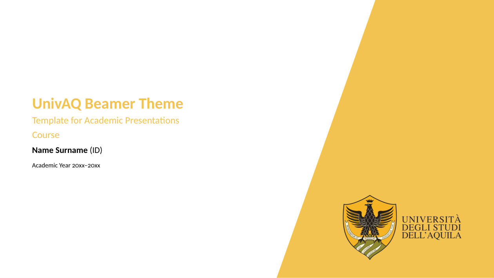
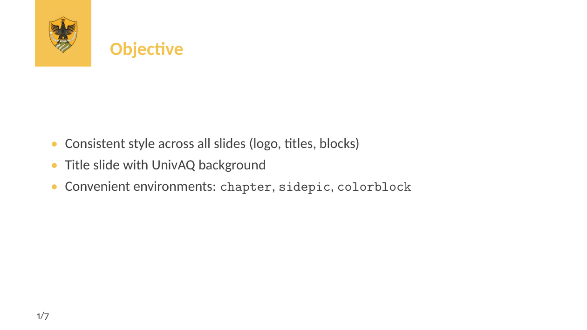
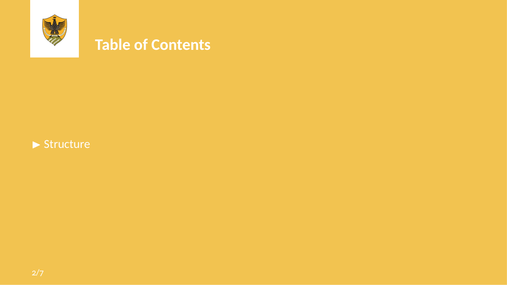
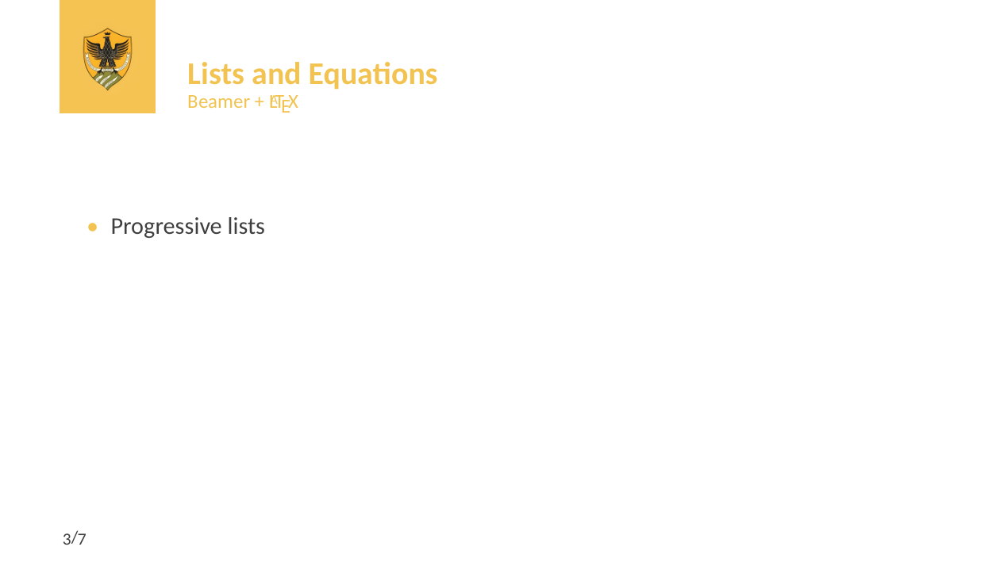
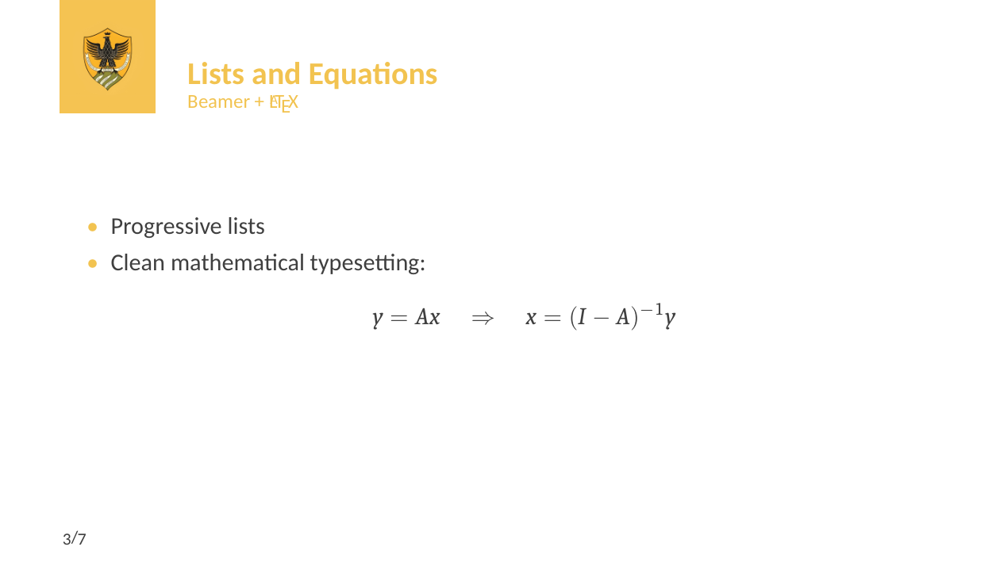
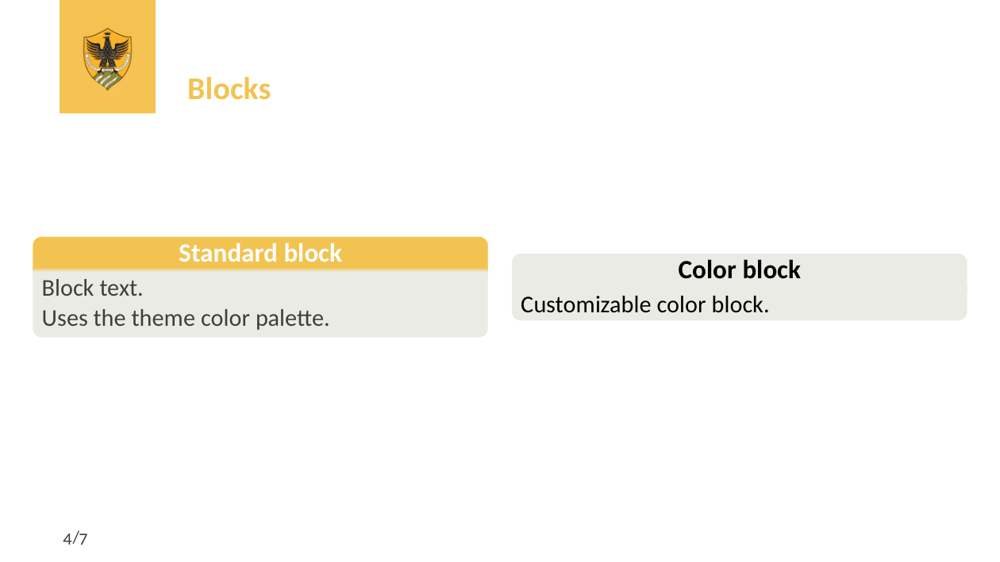

Univaq Beamer Presentation Template

An **unofficial LaTeX Beamer template** inspired by the visual identity of the University of L’Aquila (UnivAQ), designed for academic presentations such as Ph.D. courses, seminars, workshops, and conferences.

The template provides a **clean, consistent, and professional layout**, with a strong focus on readability, mathematical clarity, and institutional branding.

---

## Features

- **16:9 aspect ratio**, optimized for modern screens and projectors  
- Consistent visual identity across slides (logo, colors, typography)  
- Custom title page with optional full or split background image  
- Section-opening **chapter slides**  
- Slides with **side images** (`sidepic` environment)  
- Customizable **color blocks** (`colorblock` environment)  
- Minimal footline with optional slide numbering (`noslidenumber`)  
- Serif font for mathematics, sans-serif font for text  

---

## Screenshots

### Title page


### Objectives


### Lists and equations


### Blocks


### Chapter slide


### Side image slide


---

## Repository Structure

```
.
├── univaq.tex               # Example presentation
├── beamerthemeunivaq.sty    # Main Beamer theme
├── univaqcolor.sty          # UnivAQ color palette
├── assets/                  # Backgrounds and logos
├── screenshots/             # Preview images for README
├── LICENSE
└── .gitignore
```

---

## Requirements

A standard LaTeX distribution is sufficient:

- **TeX Live** (Linux)
- **MacTeX** (macOS)
- **MiKTeX** (Windows)

The theme relies on standard packages typically included in Beamer installations (`beamer`, `tikz`, `etoolbox`, `xcolor`, `graphicx`).

---

## Quick Start

Compile the example presentation:

```bash
pdflatex univaq.tex
```

(For best results, run the command twice.)

---

## Usage

Load the theme in your presentation:

```latex
\documentclass{beamer}
\usetheme{univaq}
```

### Title Background

Full-screen background:

```latex
\titlebackground{assets/background}
```

Split background (recommended):

```latex
\titlebackground*{assets/background}
```

### Metadata

```latex
\title{Presentation Title}
\subtitle{Optional Subtitle}
\course{Course or Program Name}
\author{Author Name}
\IDnumber{Student ID (optional)}
\date{Academic Year or Date}
```

---

## Custom Environments

### Chapter Slide

```latex
\begin{chapter}[assets/background_alternative]{maincolor}{Section Title}
Section introduction text.
\end{chapter}
```

### Side Image Slide

```latex
\begin{sidepic}{assets/background_alternative}{Slide Title}
\begin{itemize}
  \item First point
  \item Second point
\end{itemize}
\end{sidepic}
```

### Color Block

```latex
\begin{colorblock}[black]{univaqgrey}{Block Title}
Block content.
\end{colorblock}
```

---

## License and Attribution

This repository is released under the **GNU General Public License v3.0 (GPL-v3)**.

The structure and overall design of this theme are inspired by the  
[Sapienza Beamer Presentation Template](https://github.com/andrea-gasparini/sapienza-beamer-template), developed by **Andrea Gasparini**.

All UnivAQ-specific branding (logos, colors, and backgrounds) has been adapted independently for academic use.

---

## Author

**Francesco Picarazzi**  
Ph.D. Program in Business and Legal Sciences  
University of L’Aquila (UnivAQ)

---

## Disclaimer

This is an unofficial template and is not an official product of the University of L’Aquila.  
Users are responsible for ensuring that the use of logos and branding complies with institutional policies.
